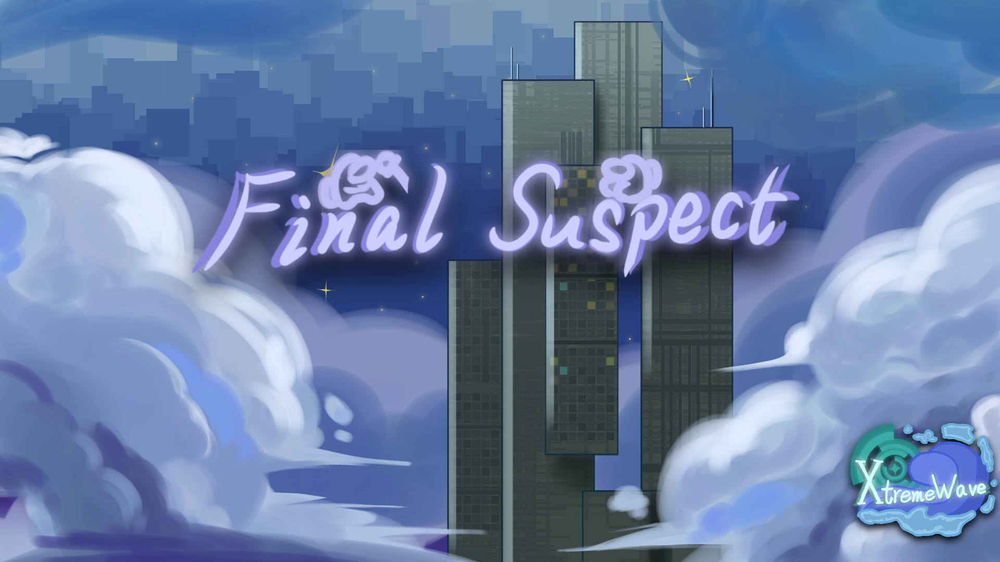

**Final Suspect: The Ultimate Among Us Mod for the Original Experience.**

[English] | [简体中文](README_zh.md)

> [!important]
> Due to academic commitments of the developer of this mod, your issue may not receive a prompt response.\
> We appreciate your understanding.

> [!NOTE]
> This mod is not affiliated with Among Us or Innersloth LLC, and the content contained therein is not endorsed or otherwise sponsored by Innersloth LLC.\
> Portions of the materials contained herein are property of Innersloth LLC. \
> © Innersloth LLC.

## Contributors

  

## Star History
