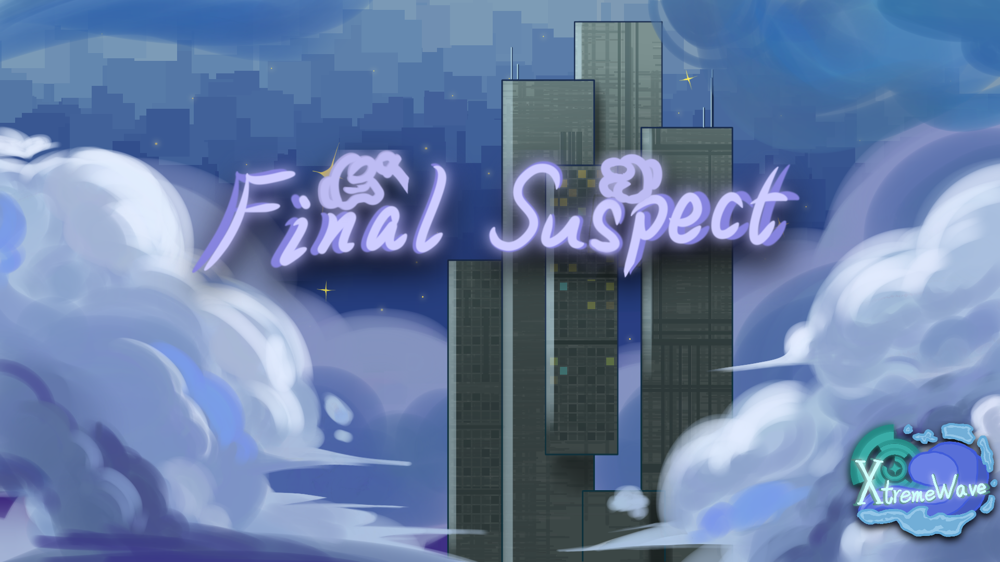

**Final Suspect: The Ultimate Among Us Mod for the Original Experience.**

[English] | [简体中文](README_zh.md)

> [!NOTE]
> This mod is not affiliated with Among Us or Innersloth LLC, and the content contained therein is not endorsed or otherwise sponsored by Innersloth LLC.\
> Portions of the materials contained herein are property of Innersloth LLC. \
> © Innersloth LLC.

## About

FinalSuspect is an original optimization plugin designed for Among Us.\
The plugin introduces 20+ optimizations to the original game, enhancing the overall experience.\
For detailed documentation on how to use this plugin (installation, updates, etc.), please refer to the [website's documentation](https://www.Final.net.cn/docs/FS/en-us/Guide/Installation).

## Contributors

  

---

Want to contribute to FinalSuspect? Check out the [CONTRIBUTING](CONTRIBUTING.md).

## Star History

