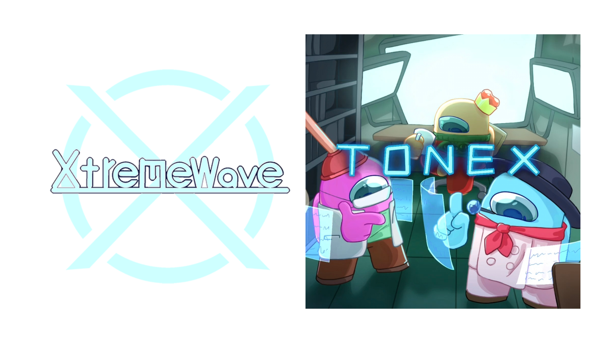

	

**TownOfNewEpic_Xtreme，Among Us Mod的出色贡献者**

[English](README.md) [简体中文]

[TONEX官方网站](https://tonex.cc) | [XtremeWave官方网站](https://www.xtreme.net.cn)

## 关于我们
自2023年5月20日起，Town Of Host Edited(TOHE)停止了开发。 
为了延续TOHE的“火种”，我们开发了一个名为Town Of Host Edited-Xi(TOHEX)的分支项目 
然而，这个项目的开发并不是一帆风顺，我们的口碑持续下滑，我们的开发毫无成果。 
最终，在2023年11月17日，TOHEX无期限停更 
应广大玩家的请求, KARPED1EM为TOHE保持最基本的兼容，并将其更名为Town Of Next(TONX)。 
因此，我们基于TONX进行改良并重新制作了TOHEX，组建了全新的制作组-XtremeWave，弥补过去的错误并以全新的面貌回归，Town Of New Epic_Xtreme(TONEX)就此诞生。 
如今的TONX再一次终止了更新，而我们也在TONEX恢复了TONX未来得及完成的TOHE的全部内容， 
让我们再一次，以“传承”的名义，继续模组的制作！

——XtremeWave

## 须知
本模组不隶属于 Among Us 或 Innersloth LLC，其包含的内容也未得到 Innersloth LLC 的认可或以其他方式赞助。 
此处包含的部分材料是Innersloth LLC的财产。

## 部分想法来源与支持
 - [Town Of Host](https://github.com/tukasa0001/TownOfHost)
 - [Town Of Next(原Town Of Host Edited)](https://github.com/KARPED1EM/TownOfHostEdited)
 - [Town Of Host_Y](https://github.com/Yumenopai/TownOfHost_Y)
 - [Town Of Host:The Other Roles](https://github.com/music-discussion/TownOfHost-TheOtherRoles)
 - [Super New Roles](https://github.com/ykundesu/SuperNewRoles)
 - [Town Of Host-ReEdited](https://github.com/Loonie-Toons/TownOfHost-ReEdited)
 - [Town Of Host:Enhanced](https://github.com/0xDrMoe/TownofHost-Enhanced)
 - [Endless Host Roles(原Town Of Host Edited Plus)](https://github.com/Gurge44/EndlessHostRoles)
 - [Town Of Us](https://github.com/Loonie-Toons/TownOfHost-ReEdited)
 - [Town-Of-Us-R](https://github.com/eDonnes124/Town-Of-Us-R)
 - [Foolers Mod](https://github.com/MengTube/Foolers-Mod)
 - [Nebula on the Ship](https://github.com/Dolly1016/Nebula)
 - [The Other Roles](https://github.com/TheOtherRolesAU/TheOtherRoles)
 - [The Other Roles: GM Edition](https://github.com/yukinogatari/TheOtherRoles-GM)
 - [The Other Roles: GM Haoming Edition](https://github.com/haoming37/TheOtherRoles-GM-Haoming)
 - [The Other Roles: GM IA Edition](https://github.com/dabao40/TheOtherRolesGMIA)
 - [Clash Of Gods](https://github.com/CognifyDev/ClashOfGods)
 - [Town Of Crew:Sea Of Shark](https://github.com/yiTOC/TOCS)
 
***感谢这些模组以及他们优秀的想法，是他们造就了我们。*** 
***更要感谢长久以来支持我们的玩家们。是您们给予了我们继续这个项目的动力!***

## 特别鸣谢
### [Town Of Host](https://github.com/tukasa0001/TownOfHost) :
- 开发者：[tukasa0001](https://github.com/tukasa0001)
- 一切都基于Town Of Host
### [Town Of Next(原Town Of Host Edited)](https://github.com/KARPED1EM/TownOfNext) :
- 开发者：[KARPED1EM](https://github.com/KARPED1EM)
- 梦开始的地方
- 我们的项目是Town Of Next的分支
- **感谢咔皮呆的近100000行优秀的代码，这为我们模组的开发建立了极好的基础**
### [Town Of Host_Y](https://github.com/Yumenopai/TownOfHost_Y) :
- 开发者：[Yumenopai](https://github.com/Yumenopai)
- 许多职业想法
- 提供职业: 监管者, 呪狼, 工作狂, 贪婪者, 潜藏者
- 参考: 修改游戏公告
- 移植了新的设置界面UI(2024.6.18后)
### [Town Of Host : The Other Roles](https://github.com/music-discussion/TownOfHost-TheOtherRoles) :
- 开发者：[Music Discussion](https://github.com/music-discussion)
- 许多职业想法
- 参考: 驱逐确认
- 参考: 分割RPC包以缓解网络压力
### [Super New Roles](https://github.com/ykundesu/SuperNewRoles) :
- 开发者：[ykundesu](https://github.com/ykundesu)
- 参考: TOHEX中的制作者名单(v2023.7.11前)
- 参考: 愚人节牧马模式(v2024.3.5前)
- 参考: 寻找模组游戏
- 参考: TOHEX中的自定义按钮
### [Town Of Plus](https://github.com/tugaru1975/TownOfPlus) :
- 开发者：[tugaru1975](https://github.com/tugaru1975)
- 参考: 千里眼
### [Revolutionary Host Roles](https://github.com/sansaaaaai/Revolutionary-host-roles) :
开发者：[sansaaaaai](https://github.com/sansaaaaai)
- 参考: 修改设置菜单
### [Town Of Host-ReEdited](https://github.com/Loonie-Toons/TownOfHost-ReEdited) :
- 开发者：[Loonie-Toons](https://github.com/Loonie-Toons)
- 许多职业想法
- 提供职业: TOHEX中的医生、分散者、变色龙
### [Project:Lotus](https://github.com/ImaMapleTree/Lotus) :
- 开发者：[ImaMapleTree](https://github.com/ImaMapleTree)
- 参考: 修改聊天框
- 参考: 选择发送目标的快捷键
### [Town Of Host:Enhanced](https://github.com/0xDrMoe/TownofHost-Enhanced) :
- 开发者：[Moe](https://github.com/0xDrMoe)
- 许多职业想法
- 参考: 愚人节牧马模式(v2024.3.5后)
### [Endless Host Roles(原Town Of Host Edited Plus)](https://github.com/Gurge44/EndlessHostRoles) :
- 开发者：[Gurge44](https://github.com/Gurge44)
- 许多职业想法
- 提供: 摸宠物事件

## 开发者成员
### XtremeWave成员
 - [喜](https://github.com/Xieiawa)- **开发组-编程 &amp; 文创组-翻译**
 - [QingFeng](https://github.com/QingFeng-awa) - **开发组-网站 &amp; 运营组-维护**
 - [Slok7565](https://github.com/Slok7565)- **开发组-编程 &amp; 文创组-音乐、翻译、宣传 &amp; 运营组-发行、交流**
 - Zeyan - **开发组-编程 &amp; 文创组-翻译**
 - 小黄117 - **文创组-美术**
 - caaattt - **文创组-美术**
 - 玖咪 - **开发组-编程**
 - JMS - **文创组-宣传**
 - [中立小黑](https://github.com/ZhongLiXiaoHei) - **文创组-翻译**
 - [空水梦冰](https://github.com/Miaoice) - **文创组-设计**
 - Hartex - **文创组-宣传**
 - ㍿ - **文创组-设计**
 - Zxylem - **文创组-设计**
 - 刻刻刻刻刻薄 - **文创组-宣传**
 - [一念旧情丶](https://github.com/ynjq) - **文创组-设计**
 - 照路行不行 - **文创组-美术**
 - 核聚变砂糖橘 - **文创组-美术**
 - 安德 - **文创组-美术**
 - 白糖 - **文创组-翻译**

### 贡献者
 - [KARPED1EM](https://github.com/KARPED1EM) - **技术支持**
 - [Yu(原名：Night)](https://github.com/Night-GUA) - **[TOHEX](https://tohex.cc)开发者**
 - ryuk - **新功能与优秀的想法**
 - [Amongus](https://github.com/XiezibanWrite) - **翻译与技术支持**
 - [NikoCat233](https://github.com/NikoCat233) - **技术支持**
 - [Farewell](https://github.com/ksduye) - **咨询支持**
 - [LezaiYa](https://github.com/LezaiYa1) - **咨询支持**
 - [Imp11](https://github.com/dabao40) - **咨询支持**
 - [FangKuai](https://github.com/FangKuaiYa) - **咨询支持**

## 星标历史

## 我们的其它开源项目
 - [TONEX官方网站](https://github.com/XtremeWave/TownOfNewEpic_XtremeSite) -使用了 VuePress-reco.
 - [TONEX车队姬](https://github.com/XtremeWave/TownOfNewEpic_Xtreme_CHAN) - 由天梦LK提供技术支持.

## :warning: 遇到问题/bug :warning:
|      你       |      如何解决     |
|:------------:|:---------------------------------:|
|    提出弱智问题    | 想都别想|
| 礼貌且问题明确并给出日志 | 尽全力帮助您|