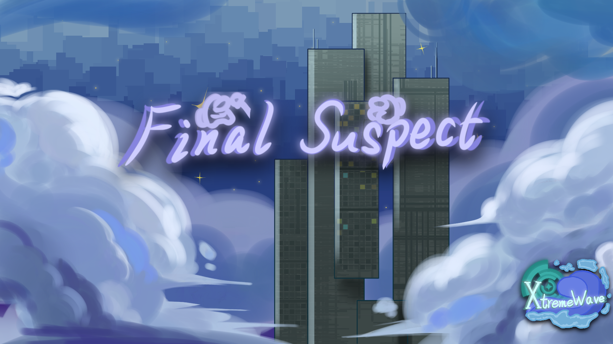

**Final Suspect 終極嫌疑，你最棒的Among Us原版輔助模組。**

## 語言
***本模組支援Among Us所支援的全部語言！*** 
[English](README.md)  
[Latam](README_es_LA.md) 
[Brasileiro](README_pt_BR.md) 
[Português](README_pt.md) 
[한국어](README_ko.md) 
[Русский](README_ru.md) 
[Nederlands](README_nl.md) 
[Filipino](README_tl.md) 
[Français](README_fr.md) 
[Deutsch](README_de.md) 
[Italiano](README_it.md) 
[日本語](README_ja.md) 
[Español](README_es.md) 
[簡體中文](README_zh.md) 
[繁體中文] 
[Gaeilge](README_ga.md) 

## 须知
本模組不隸屬於 Among Us 或 Innersloth LLC，其包含的內容也未得到 Innersloth LLC 的認可或以其他方式贊助。 
此處包含的部分材料是 Innersloth LLC 的財產。

## 貢獻者
>[KARPED1EM](https://github.com/KARPED1EM) - **技術支援** 
>Bug修復指導

>[Yu(原名：Night)](https://github.com/Night-GUA) - **技術支援** 
>新增提示&

>[Amongus](https://github.com/XiezibanWrite) - **翻譯&技術支援** 
>部分翻譯文本支援&開發過程支援

>[NikoCat233](https://github.com/NikoCat233) - **技術支援** 
>反作弊指導

> [QingFeng](https://github.com/QingFeng-awa) - **Api支援** 
>提供了 Xtreme Api 支援！

>[𝑵𝒐𝒏𝒂𝒍𝒖𝒔🍥](https://github.com/Reborn5537) - **技術支援** 
>為 FAC 新增了對 KillNetWork 的檢查

>[LezaiYa](https://github.com/LezaiYa1) - **諮詢支援**

>[Imp11](https://github.com/dabao40) - **諮詢支援**

>[FangKuai](https://github.com/FangKuaiYa) - **諮詢支援**

>[ELinmei](https://github.com/linmeideli) - **諮詢支援**

## 星標歷史
